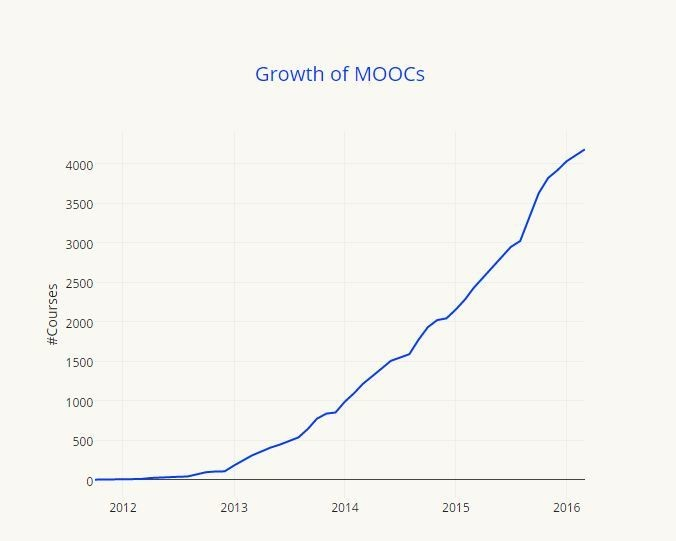

I Massive Open Online Courses (MOOCs) sono corsi online brevi e gratuiti a disposizione di tutti. Offrono la possibilità di interagire direttamente con il docente, organizzare gruppi di lavoro e mettere onestamente alla prova il proprio apprendimento. Il loro arrivo nel web ha originato una rivoluzione nel mondo dell’alta formazione, anche se i risultati conseguiti ad oggi non sempre hanno raggiunto le aspettative iniziali.

Se da una parte è stato accertato che un grandissimo numero di studenti non termina i MOOC iniziati perdendo l’entusiasmo, dall’altra questa forma di Social Learning permette di frequentare corsi e ottenere certificazioni da alcune delle più prestigiose università al mondo.

**Vi chiederete quali sono le Università da tenere d’occhio per iniziare un MOOC.**

Le migliori università che hanno aderito al movimento sono  Caltech, Harvard, MIT, Stanford, Sorbonne, Peking, e ora anche Oxford.
Le piattaforme di apprendimento internazionali hanno stretto relazioni con centinaia di Università,centri di ricerca e istituzioni per programmare i corsi (e che vi consigliamo di controllare)sono tantissime: [Coursera](https://www.coursera.org/) e [edX](https://www.edx.org/)  attualmente dominiano il mercato dei MOOC con rispettivamente il 35.6% e 18.1%  dei corsi.  Solo nel 2015 Coursera ha avuto 17 milioni di studenti!

In Italia le Università che si sono spese per l’avvio dei MOOC sono la [Ca’ Foscari di Venezia](http://www.unive.it/pag/10068/) l’[Università di Roma](https://www.coursera.org/sapienza), Il Politecnico di Milano - [Polimi Open Knowledge](https://www.pok.polimi.it/) e l’università di Napoli con [Federica WebLearning](http://www.federica.eu/). Le principali piattaforme italiane che ospitano i MOOC sono [EMMA](http://platform.europeanmoocs.eu/) e [EDUOPEN](http://eduopen.org/), il primo finanziato dall'Unione Europea e il secondo dal MIUR.

## Dalle origini del Mooc a oggi

Nel 2008 Georg Siemens dell’Athabaska University conia il termine MOOC durante il convegno “Connectivism and Connective Knowledge", solo 3 anni dopo i MOOC cominciano ad essere distribuiti su scala mondiale.

- Nel 2011 la Stanford University lancia [3 corsi aperti a tutti](http://ai.stanford.edu/~ang/papers/mooc14-OriginsOfModernMOOC.pdf) coloro in possesso di una connessione internet. Uno di questi tenuto da Sebastian Thrun and Peter Norvig sul tema dell’Intelligenza artificiale attrasse più di [160.000 studenti](https://www.wired.com/2012/03/ff_aiclass/). Sull’onda di quel successo Thun E Norvig costruirono il business model per l’educazione online [Udacity](https://www.udacity.com/)

- 2012: La popolarità dei corsi della Stanford ha spinto altre Università a creare MOOC e così emersero altre due piattaforme: Coursera and EdX.  Quell’anno The New York Times proclamò il 2012 ‘The Year of the Mooc’- l'[articolo](http://www.nytimes.com/2012/05/16/opinion/friedman-come-the-revolution.html?_r=0) di FRIEDMAN è un MUST-READ sull'argomento.

- 2013: La Open University creò la sua personale piattaforma MOOC [Futurelearn](https://www.futurelearn.com/), offrendo corsi dalle università britanniche. Emersero altre piattaforme MOOC, come la [Open2Study](http://moocnewsandreviews.com/aussie-collaborative-launches-new-mooc-platform-open2study/) in Australia e [iversity](https://iversity.org/) in Germania.

- 2014: Il numero di Università che offrivano MOOCS raddoppiò a più di 400.

- 2015: Il numero di studenti che si iscrivevano ai MOOC arrivò a [35 milioni](https://www.class-central.com/report/moocs-2015-stats/), superando la previsione dei 16-18 milioni fatta per il 2014.

- 2016: L’università di Oxford annuncia il suo primo [MOOC -  From Poverty to Prosperity: Understanding Economic Development](https://www.edx.org/course/poverty-prosperity-understanding-oxfordx-oxbsg01x), un’adesione che aiuterà a rafforzare la credibilità dei MOOC.
